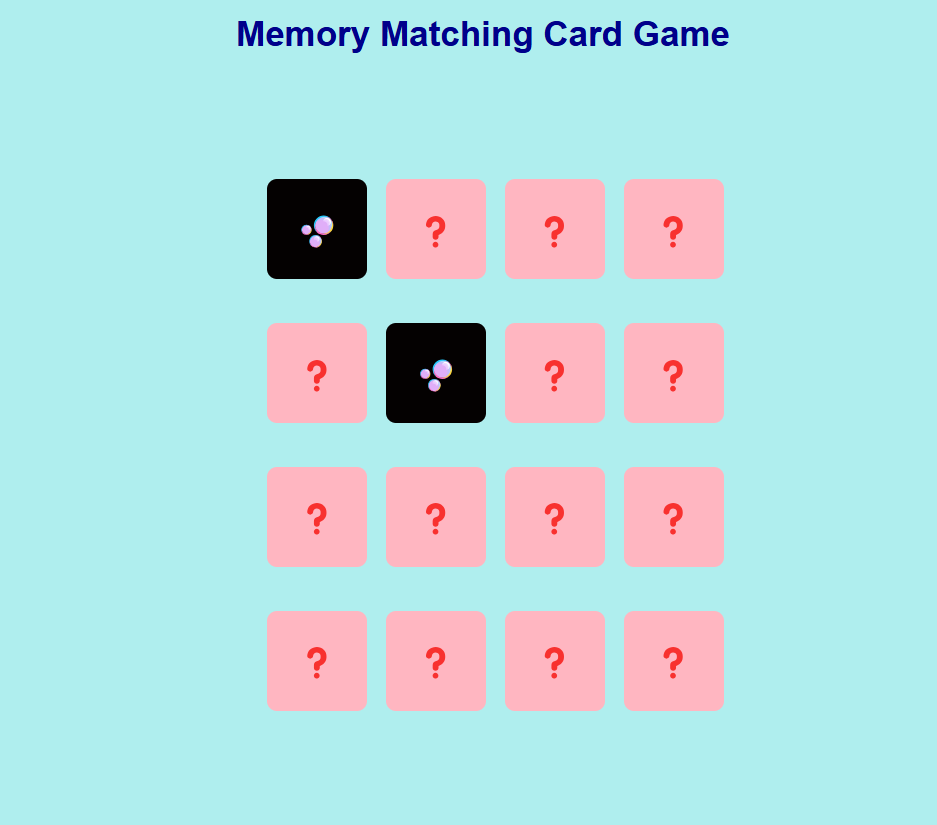

# 🧠 Memory Card Matching Game (React)

A fun and interactive **memory card matching game** built with React. Flip cards to find matching pairs of emojis — a simple game to test your memory!

---

## 📌 Features
- ✅ **Emoji Card Deck**: Cards use cute emojis to represent pairs.
- ✅ **Flip Animation**: Cards flip when clicked, showing their content.
- ✅ **Match Logic**: Automatically checks for matches and keeps them revealed.
- ✅ **Reset Button**: Instantly resets the game with a reshuffled deck.
- ✅ **Responsive Grid**: Cards are neatly displayed using CSS grid.

---

## 🛠️ Technologies Used
- ⚛️ **React** (`useState`, `useEffect`)
- 🎨 **CSS** (`style.css` for layout and styling)
- 🧩 **JS Logic** (Deck shuffle, matching logic, and reset function)

---

## 🚀 Live Demo
To see it in action, clone the repository and follow the setup instructions below.

1. **Clone the repository:**

   ```bash
   git clone https://github.com/Eshhaa11/memory-card-matching-game
   
   
2. **Navigate to the project directory:**

   cd  memory-card-matching-game

3. **Install dependencies:**

   npm install

4. **Start the development server:**

   npm start

5. **Open your browser and visit:**

   http://localhost:3000

---

 ## 🎨 Screenshots:
 


 ---

 ## 🤝 Contributing:
 Want to improve this project? Fork the repository, create a feature branch, and open a pull request. All contributions are welcome! 🚀✨
 
 ---

 🎉 Happy Coding!